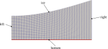
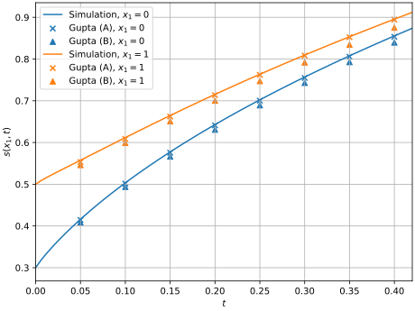

## The Problem

In this example we will look at a problem that was originally introduced by [@Rasmussen.1977] and later extended by [@Gupta.1986] who introduced new initial conditions to the problem. It is one of these new initial conditions that we will use in the following. Similar to the [classical Stefan Problem](https://en.wikipedia.org/wiki/Stefan_problem) it describes the melting of a phase-change material. The solid part of the material is assumed to be at melt temperature. Energy is supplied to the system by providing a constant temperature boundary condition at the boundary of the liquid domain. The difference to the classical Stefan problem is that this time the solid-liquid interface position is given as a surface in 2D space. The problem can therefore be seen as an extension of the classical Stefan problem into a second dimension. If parametrized in the same way as the classical Stefan problem, it would correspond to a Stefan number of $Ste = 1$.

## Running the simulation

The case can be found in `examples/2D-stefan-problem/`. To run the simulation run
```bash
blockMesh
foamRun
```
to first create the mesh and then to start the simulation. Use
```bash
paraFoam
```
to visualize the result. The script `plot_result.py` can be used to compare the simulation result with two different semi-analytical solutions from [@Gupta.1986].

The `Allclean` script can be used to remove the simulation results.

## The Mesh

Below you can see the mesh for the initial time step. Since the solid part of the phase-change material is assumed to be at melt temperature we only need to simulate the liquid domain.



At the patch "bottom" we will specify a fixed temperature. The patch "ice" is the interface between the solid and the liquid domain.

## Solver setup

Since we do not need to solve for any fluid flow (the fluid is assumed to not move), we will select the *solver* of type *movingMesh* which will handle the mesh movement:
```c++
// from system/controlDict
application     foamRun;
solver          movingMesh;
```

For computing the temperature field we will use the *scalarTransport* functionObject with the following setup:
```c++
// from system/functions
temperatureTransport
{
    type            scalarTransport;
    libs            ( "libsolverFunctionObjects.so" );
    field           T;
    diffusivity     constant;
    D               1;
    execteControl   timeStep;
    writeControl    writeTime;
}
```
When executed, this functionObject will solve an advection-diffusion equation for a field called "T": Our temperature field. This alone would however not give the correct result as we need to account for the moving mesh. We will do so by computing a flux field "phi" as the negative "meshFlux". "phi" is used as the advective term in the *scalarTransport* functionObject. We will do this using an on-the-fly constructed functionObject:
```c++
// from system/calculatePhi
type            coded;
libs            ("libutilityFunctionObjects.so");
name            calculatePhi;

codeInclude
#{
    #include "surfaceFields.H"
#};

codeExecute
#{
    tmp<surfaceScalarField> tphi = surfaceScalarField::New
    (
        "phi",
        mesh(),
        dimVelocity * dimArea
    );

    if(foundObject<surfaceScalarField>("meshPhi"))
    {
        tphi.ref() = -1 * lookupObject<surfaceScalarField>("meshPhi");
    }
    else {
        tphi.ref() = dimensionedScalar(dimVelocity * dimArea, 0.0);
    }
    store(tphi);
#};
```
This is step is only necessary as we do not solve for any fluid flow in the domain. Usually the fluid-solver would take care of the calculation of "phi".

The setup for the solution algorithm is simple. We will solve a transient case with only one iteration per time step:
```c++
PIMPLE
{
    nOuterCorrectors         1;
    moveMeshOuterCorrectors  false;
}
```
This is possible as we will treat the mesh velocity fully explicitely (more on that in the next section). If we wanted to treat the mesh velocity implicitely, we would need to make multiple iterations per time step until we converge to the correct velocity. We also need to set the *moveMeshOuterCorrectors* to `true` for this case. However, for our choice to calculate the temperature field using a functionObject, a purely explicit time step is actually our only possible option. The reason for this is that all functionObjects are only executed once per time step. An implicit treatment of the boundary velocity however requires the boundary velocity to be updated multiple times during a time step to slowly converge to the actual true velocity of the given time step. Since the melt velocity is a function of the temperature field and the temperature field is only updated once per time step (thanks to the functionObject), this is not possible. Currently, OpenFOAM offers no good builtin alternative. The only good way of for the given example would be write our own solver (which in this case is absolutely possible and not that hard).

## Dynamic Mesh setup

To enable mesh movement for the simulation, we need a file called `dynamicMeshDict` inside the `constant/` directory. Here we must choose a *motionSolver* that handles the mesh movement. In principle, we have two options: The builtin *velocityLaplacian* or the [*explicitImplicitVelocityLaplacian*](../documentation/explicitImplicitVelocityLaplacian.qmd) that is introduced with this library. The builtin *velocityLaplacian* should be used for a purely explicit time integration of the mesh velocity and the *explicitImplicitVelocityLaplacian* for any other case. We will choose the builtin *velocityLaplacian* for this example as we are treating the mesh velocity explicitely:
```c++
// from constant/dynamicMeshDict
mover
{
    type motionSolver;

    libs            ("libfvMotionSolvers.so");
    motionSolver    velocityLaplacian;
    diffusivity     uniform;
}
```

Finally, we need to specify the correct boundary conditions for the mesh velocity inside the filed `pointMotionU`. The velocity of the patch "ice" is governed by the velocity of melting and refreezing. We therefore choose the [*onePhaseStefanMeltVelocity*](../documentation/onePhaseStefanMeltVelocity.qmd) as boundary condition which is introduced with this library:
```c++
// from 0/pointMotionU
ice
{
    type                onePhaseStefanMeltVelocity;
    kappaOverRhoH       1;
    URef                (0 0 0);
    linearUpwindBlendingFactor      0;
    laplaceSmoothing    true;
    value               uniform (0 0 0);
}
```
The *onePhaseStefanMeltVelocity* is made to be used for the boundary of one phase when the adjacent phase is at constant melt temperature and therefore does not exist as part of the simulation.

## The Result

Below you can see the result of the simulation compared to two semi-analytical solutions form [@Gupta.1986]. Generated from the script `plot_result.py`.


