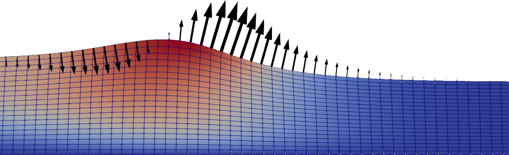

## The Problem

In this example we will simulate a simple 2D free-surface wave in a container with symmetry conditions on both sides. We start the simulation with a sinusoidal displacement of the fluid but with the fluid being at rest. Due to the presence of gravity the wave will then start moving forward. To make the simulation setup as simple as possible we will assume a highly viscous fluid ($\nu = 10^{-3} \, \text{m}^2 / \text{s}$).

## Running the simulation

The case can be found in `examples/free-surface-wave/`. To run the simulation run
```bash
blockMesh
foamRun
```
to first create the mesh and then to start the simulation. Use
```bash
paraFoam
```
to visualize the result.

The `Allclean` script can be used to remove the simulation results.

## Solver setup

For the solver we will choose the *incompressibleFluid* solver (the equivalent of *simpleFoam* and *pimpleFoam* in earlier OpenFOAM versions):
```c++
// from system/controlDict
application     foamRun;
solver          incompressibleFluid;
```

This solver solves the pressure field and velocity field for an incompressible fluid of constant material properties. To include the effect of gravitational acceleration we will use the *fvModel* called *buoyancyForce*:
```c++
// from constant/fvModels
buoyancyForce
{
    type        buoyancyForce;
}
```
This will add the gravitational acceleration as a source term to the momentum equation. The acceleration vector is specifie as a field in `constant/g`.

Since we are planning on using an implicit treatment of the free surface velocity, we need to set the *moveMeshOuterCorrectors* to true in the solution algorithm (the opposite would be true if we want to use an explicit treatment). It is also recommended to set *correctPhi* to true for moving meshes:
```c++
// from system/fvSolution
PIMPLE
{
    moveMeshOuterCorrectors  true;
    correctPhi               true;
    //...
}
```

## Dynamic Mesh setup

To enable mesh movement for the simulation, we need a file called `dynamicMeshDict` inside the `constant/` directory. Here we must choose a *motionSolver* that handles the mesh movement. In principle, we have two options: The builtin *velocityLaplacian* or the [*explicitImplicitVelocityLaplacian*](../documentation/explicitImplicitVelocityLaplacian.qmd) that is introduced with this library. The builtin *velocityLaplacian* should be used for a purely explicit time integration of the mesh velocity and the *explicitImplicitVelocityLaplacian* for any other case. We will choose the *explicitImplicitVelocityLaplacian* for this example:
```c++
// from constant/dynamicMeshDict
mover
{
    type motionSolver;

    motionSolver    explicitImplicitVelocityLaplacian;
    theta           1;
    diffusivity     uniform;
}
```
*theta* set to 1 means that we treat the mesh velocity fully implicitely.

The *motionSolver* will instanciate the field `pointMotionU` which holds the values for the mesh velocity. On the free surface (in the example the patch is called *freeSurface*) we use the [*kinematicSurfaceVelocity*](../documentation/kinematicSurfaceVelocity.qmd) boundary condition which is introduced with this library:
```c++
// from 0/pointMotionU
freeSurface
{
    type                        kinematicSurfaceVelocity;
    linearUpwindBlendingFactor  0.97;
    laplaceSmoothing            true;
    value                       $internalField;
}
```
This boundary condition will set the mesh velocity equal to the surface-normal component of the velocity field.

## Boundary conditions for $p$ and $U$

For the pressure field we will assume assume a constant value on the free surface patch. For the other boundaries we will use the *fixedFluxPressure* boundary condition. This boundary condition is used as due to the gravitational acceleration we can not use a zero gradient condition. The *fixedFluxPressure* boundary condition is exactly made for this scenario.

For the velocity field we will use a *zeroGradient* boundary condition. This corresponds to the assumption of no shear stress on the surface.

<br>
{width=100%}


