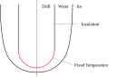
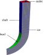
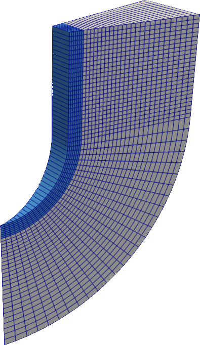

## The Problem

Hot-Point drilling is a technique that can be used to create holes in a phase-change material through close-contact melting. In this example we will simulate how a simple cylindrical drill is pushed into a body of water ice. The word drill might be a bit misleading as the drill is not rotating like a traditional drill. It instead has a hot tip which is used to liquify the material in front of it. From the simulation we can also calculate the force that is required to push against the drill to maintain a constant rate of penetration. Below you can see an illustraion of the problem.



Due to the hot tip, the thermal drill melts the ice in front of it. While decending down it then pushes away the freshly melted water and squeezes it through the so-called melt channel that surrounds the drill. The flow of fluid creates a drag force which needs to be equal in magnitude to the force that pushes the drill down and into the ice.

In the following, we will choose the parameters of the problem as follows:

- Radius of the drill $R = 1 \, \text{cm}$
- Penetration velocity $V = 0.5 \, \text{mm/s}$
- Drill head temperature $T_h = 40 \, ^\circ\text{C}$
- Perfect thermal insulation on the side of the drill

For the ice temperature, we will distinguish between two cases:

1. Ice with an ambient temperature of $T_\infty = 0 \, ^\circ\text{C}$
2. Ice with an ambient temperature of $T_\infty = -20 \, ^\circ\text{C}$


## Numerical Setup for isothermal ice ($T_\infty = 0 \, ^\circ\text{C}$)

### Running the simulation

The case can be found in `examples/hot-point-drill-onePhase/`. To run the simulation run
```bash
blockMesh
foamRun
```
to first create the mesh and then to start the simulation. Use
```bash
paraFoam
```
to visualize the result.

The `Allclean` script can be used to remove the simulation results.

### General setup

As a general solution strategy we start with an initial guess for the shape of the melt channel and then let it evolve naturally by melting and refreezing until the result is converged to a steady-state solution. The movement of the solid-liquid interface is realised by moving the underlying mesh. Since the drill is moving with a constant velocity, it is convenient to view the problem from the reference frame of the drill. We will therefore regard the drill as stationary while the ice is moving with the velocity $V$ upwards. Very importantly, due to our assumption that the ice is at a constant temperature equal to the melt temperature we do not need to simulate the temperature transport inside of the ice. This means that we can completely eliminate the ice from our simulation setup. Any effect that the ice has can be included over boundary conditions. Things will of course change once the ice is not at melt temperature. More on that later.

### The Mesh

The mesh for the simulation is generated using the *blockMesh* utility from the file `system/blockMeshDict`. Have a look for yourself. The file is also parameterized. Feel free to play around with the parameters like length, radius or mesh resolution. Due to the radial symmetry of the drill, it is not necessary to simulate the flow around the whole drill. It is sufficient to take out one "wedge" from the drill and resolve it with one cell in the circumferential direction. OpenFOAM even provides special boundary conditions called *wedge* for this scenario. Below you can see a picture of the mesh and also the names of all important patches.



### Solver setup

For the solver we will choose the *incompressibleFluid* solver (the equivalent of *simpleFoam* and *pimpleFoam* in earlier OpenFOAM versions):
```c++
// from system/controlDict
application     foamRun;
solver          incompressibleFluid;
```

This solver solves the pressure field and velocity field for an incompressible fluid of constant material properties. For computing the temperature field we will use the *scalarTransport* functionObject with the following setup:
```c++
// from system/functions
temperatureTransport
{
    type            scalarTransport;
    libs            ( "libsolverFunctionObjects.so" );
    field           T;
    diffusivity     constant;
    D               0.15e-6;
    execteControl   timeStep;
    writeControl    writeTime;
}
```
When executed, this functionObject will solve an advection-diffusion equation for a field called "T": Our temperature field. In general, the combination of the *incompressibleFluid* solver together with the *scalarTransport* functionObject is not the only possible option. Instead we could have also chosen the *fluid* solver which provides a temperature field by solving an actual energy equation.

Since we want to simulate the movement of the solid-liquid interface, the simulation generally needs to be transient. However, this does not necessarily mean that we have to solve the transient versions of the Navier-Stokes and the temperature equations. Since the characteristic time scale of the melting and refreezing is large compared to the characteristic time of the fluid motion, we can assume that the velocity and temperature field are quasi-stationary. Once the shape of the melt channel has converged to one solution and does not change any longer over time, this assumption also becomes exact. We will therefore treat equations for $p$, $U$ and $T$ as time-independent:
```c++
// from system/fvSchemes
ddtSchemes
{
    default         steadyState;
}
```
This setup has the advantage that we do not need to worry about the courant number when solving for pressure, velocity and temperature. This means that we can take larger time steps and arrive at the final solution more quickly.

We set up the solution algorithm to effectively solve a steady-state problem at every time step with the SIMPLEC algorithm (the PIMPLE algorithm with relaxation factors and the parameter nCorrectors set to 1 becomes effectively a SIMPLE algorithm. Together with the parameter consistent set to `true` the algorithm is called SIMPLEC):
```c++
// from system/fvSolution
PIMPLE
{
    nOuterCorrectors 1000;
    correctPhi false;
    moveMeshOuterCorrectors false;
    nNonOrthogonalCorrectors 3;
    consistent true;
    nCorrectors	1;

    outerCorrectorResidualControl
    {
        p
        {
            tolerance   1e-5;
            relTol      0;
        }
    }
}
```
As convergence criterion for the outer PIMPLE corrector (such that we do not do the full 1000 outer iterations every time step) we use the initial residual of the $p$ equation. Using the initial residual of the $U$ equation is not useful for setups where the rotational symmetry of the geometry is modeled as a quasi two dimensional wedge as the residual for the flow velocity in the circumferencial direction will stay relatively large. One crucial detail for the setup is the parameter *moveMeshOuterCorrectors*. This parameter should be set to `false` for an explicit treatment of the mesh velocity and to `true` otherwise. The reason for this is that for an explicit mesh update the mesh displacement is calculated only from parameters of the old time step. In that case, a repeated mesh update will not have any effect that is different to the very first mesh update and will at best only consume resources unnecessarily. Using the builtin *motionSolver* *velocityLaplacian*, this would even give wrong results.

### Dynamic Mesh setup

To enable mesh movement for the simulation, we need a file called `dynamicMeshDict` inside the `constant/` directory. Here we must choose a *motionSolver* that handles the mesh movement. In principle, we have two options: The builtin *velocityLaplacian* or the [*explicitImplicitVelocityLaplacian*](../documentation/explicitImplicitVelocityLaplacian.qmd) that is introduced with this library. The builtin *velocityLaplacian* should be used for a purely explicit time integration of the mesh velocity and the *explicitImplicitVelocityLaplacian* for any other case. We will choose the builtin *velocityLaplacian* for this example:
```c++
// from constant/dynamicMeshDict
mover
{
    type motionSolver;

    libs            ("libfvMotionSolvers.so");
    motionSolver    velocityLaplacian;
    diffusivity     uniform;
}
```
In fact, for our choice to calculate the temperature field using a functionObject, a purely explicit time step is our only possible choice. The reason for this is that all functionObjects are only executed once per time step. An implicit treatment of the boundary velocity however requires the boundary velocity to be updated multiple times during a time step to slowly converge to the actual true velocity of the given time step. Since the melt velocity is a function of the temperature field and the temperature field is only updated once per time step (thanks to the functionObject), this is not possible. In order to use an implicit time integration for the mesh velocity, we would have to switch to a different solver like the *fluid* solver or we would need to make some small modifications to the *incompressibleFluid* solver. As already mentioned in the previous section, we have to make sure to also set the *moveMeshOuterCorrectors* to `true` if we want to use an implicit time integration for the boundary velocity.

The final ingredient for the simulation is the field called `pointMotionU`. This field is needed by the *motionSolver* and contains the mesh velocity for every mesh point at a given time step. While the velocity of the mesh internal points is calculated by the *motionSolver*, the velocity on the boundary patches is specified using boundary conditions. The velocity of the patch "ice" should be governed by the velocity of melting and refreezing. We therefore choose the [*onePhaseStefanMeltVelocity*](../documentation/onePhaseStefanMeltVelocity.qmd) as boundary condition which is introduced with this library:
```c++
// from 0/pointMotionU
ice
{
    type            onePhaseStefanMeltVelocity;
    kappaOverRhoH   1.8e-9;
    URef            (0 5e-4 0);
    linearUpwindBlendingFactor  0.8;
    laplaceSmoothing            true;
    value           uniform (0 0 0);
}
```
The *onePhaseStefanMeltVelocity* is made to be used for the boundary of one phase when the adjacent phase is at constant melt temperature and therefore does not exist as part of the simulation. For the parameters we choose *URef* as negative $V$ due the shift of reference frames: The drill is assumed to be stationary while the ice around the probe moves upwards with the velocity $V$. For an explanation of the other parameters see [onePhaseStefanMeltVelocity](../documentation/onePhaseStefanMeltVelocity.qmd) and [mesh velocity boundary conditions](../documentation/mesh_velocity_bc.qmd). The boundary conditions for the other patches are straight forward. We do not want the mesh to move at the drill boundaries. We therefore specity a fixed value of (0 0 0). On the other boundaries we want to restrict the mesh movement only in the patch normal direction. We therefore use a *fixedNormalSlip* boundary condition.

### Boundary conditions for $p$, $T$ and $U$

The boundary conditions for $p$ and $T$ are straight forward. For the pressure, we will choose a fixed value at the outlet and zero gradient everywhere else. For the temperature we can choose a fixed value at the melt head and the ice (equal to the melt temperature) and zero gradient everywhere else.

For the velocity field we will choose the [stefanFlowVelocity](../documentation/stefanFlowVelocity.qmd) boundary condition for the patch "ice":
```c++
// from 0/U
ice
{
    type            stefanFlowVelocity;
    URef            (0 5e-4 0);
    rhoRatio        0.917;
    value           uniform (0 0 0);
}
```
Assuming that the density of the ice is equal to the density of the water, we could even simplify this boundary condition and replace it with a *fixedValue* boundary condition with the value set equal to $V$. The reason for this is explained in [stefanFlowVelocity](../documentation/stefanFlowVelocity.qmd).

### Calculating the Drag Force

To calculate the force that is exerted by the fluid onto the drill (and by doing so to estimate the force we would need to push the drill into the ice) we use another functionObject called *forces* (see `system/functions` for reference). The functionObject will save its results under `postProcessing/drag/0/forces.dat`. To obtain the actual drag force for the entire drill we need to remember that we only simulated the flow of fluid around one wedge of the drill. For the chosen opening angle of the wedge of $2^\circ$ we need to therefore multiply the result with $180$ to get get the correct force.

## Numerical Setup for $T_\infty = -20 \, ^\circ\text{C}$

### Running the simulation

The case can be found in `examples/hot-point-drill-twoPhase/`. To run the simulation run
```bash
./Allmesh
foamMultiRun
```
to first create the mesh and then to start the simulation. Use
```bash
paraview *.OpenFOAM
```
to visualize the result. This command will start paraview with the two regions "water" and "ice" loaded. This command works because of the two text files ending with ".OpenFOAM" that were created by the `Allmesh` script and that will tell praraview which regions exist in the simulation setup.

Like before, the `Allclean` script can be used to purge the simulation results.

### Multi Region setup

Unlike for the isothermal simulation, the temperature transport in the ice can no longer be ignored if the ambient ice is colder than the melt temperature. We will solve this problem by splitting the simulation into two regions: The "water" region which is set up in almost the same way as before and the "ice" region. The *foamMultiRun* application that is used to run a multi-region case treats the different regions as almost independent. All regions have their own mesh, their own solvers and their own fields. Compared to the single-region setup, all files that belong to a specific region are located in a folder with the name of the region. For example, you will find the initial conditions for the "water" region inside the `0/water/` folder, all relevant parameters for the solver in `system/water/` and so on.

### Multi Region Mesh

For a multi-region case we need to create separate meshes for all the different regions. At the same time we need to set up the possibility to map values at the interface between the regions. The easiest way to achieve this is to first create a mesh that includes both regions and then to split it at the interface using the *splitMesh* utility. This is exactly what is happening when executing the `Allmesh` script: First, a single mesh is constructed using the *blockMesh* utility and then split into the two regions "ice" and "water". Below you can see the resulting mesh.

{width=25%}

After the split, there are two patches that represent the boundary between the two phases: From the "water" region the patch is called *water_to_ice* and from the "ice" region it is called *ice_to_water*. These names are automatically chosen by *splitMesh* based on the two region names.

### Multi Region Solver setup

The solver setup for the given problem looks as follows:
```c++
// from system/controlDict
application     foamMultiRun;
regionSolvers
{
    water       incompressibleFluid;
    ice         movingMesh;
}
```
Like before, we use the *incompressibleFluid* solver to solve for the fluid motion in the melt channel combined with the *scalarTransport* functionObject to solve for the temperature transport. For the ice we do not need to solve for any fluid motion. We therefore select the *movingMesh* solver to handle the mesh movement. For the temperature transport inside the ice we will also use a *scalaTransport* functionObject.

We will assume that the temperature transport inside the ice is governed by a simple diffusion with constant thermal conductivity. Since we view the problem from from the perspective of the drill this means that the temperature transport is governed by an advection-diffusion equation with a constant advection of negative $V$ (if we assume the drill moves with the constant velocity $V$). In order to "tell" the *scalarTransport* functionObject what the correct advection is we use an on-the-fly constructed functionObject that computes the correct face flux and stores it under the name "phi":
```c++
// from system/functions
#includeFunc calculatePhi(region=ice)
```
and
```c++
// from system/calculatePhi
type            coded;
libs            ("libutilityFunctionObjects.so");
name            calculatePhi;

codeInclude
#{
    #include "volFields.H"
    #include "surfaceFields.H"
#};

codeExecute
#{
    const dimensionedVector v(dimVelocity, vector(0, 5e-4, 0));

    tmp<surfaceScalarField> tphi = surfaceScalarField::New
    (
        "phi",
        v & mesh().Sf()
    );
    store(tphi); //store or update
#};
```
The code updates phi by computing the dot product of the constant advection velocity and the area-weighted face normals of the mesh (`&` performes a dot product). The name "phi" is not arbitrary. In OpenFOAM it generally stands for the face flux. This is also the name that the *scalarTransport* functionObject will try to "look up" by default in the object registry when looking for the correct advection. The whole trick of calcualting phi in such a simple way only works as we assume a steady-state temperature field. Otherwise we would need to include the mesh velocity in our calculation of phi as well

### Multi Region Dynamic Mesh setup

The general setup for the dynamic mesh is the same as for the iothermal ice. The one component that is now different is the boundary condition for the water-ice interface which needs to be specified for the field *pointMotionU* in both the "water" and the "ice" region:
```c++
// from 0/water/pointMotionU
water_to_ice
{
    type            twoPhaseStefanMeltVelocity;
    rhoTimesH       334e6;
    kappa           0.56;
    URef            (0 5e-4 0);
    linearUpwindBlendingFactor  0.8;
    laplaceSmoothing            true;
    value           uniform (0 0 0);
}

// from 0/ice/pointMotionU
ice_to_water
{
    type            twoPhaseStefanMeltVelocity;
    rhoTimesH       334e6;
    URef            (0 5e-4 0);
    kappa           2.22;
    linearUpwindBlendingFactor  0.8;
    laplaceSmoothing            true;
    value           uniform (0 0 0);
}
```
The [*twoPhaseStefanMeltVelocity*](../documentation/twoPhaseStefanMeltVelocity.qmd) which is introduced with this library correctly calculates the melting and refreezing velocity by also considering the energy transport from the adjacent region.

## Comparing the examples

When comparing the drag forces for the case with isothermal ice with ice at $-20 \, ^\circ\text{C}$ one can see that the force roughly doubles for the colder ice. The reason for this is that the melt channel is smaller for the colder ice since we "loose" some of the thermal energy which is conductively transported into the ice to heat it up. At the same time the amount of fluid that is squeezed through the channel stays almost the same since we move with the same velocity. This leads to a highter pressure drop in the melt channel. When choosing the lengh of the drill as slightly larger than in the example we can even observe some re-freezing of the melt channel, i.e. the melt channel first becomes wider close to the drill head and then becomes more narrow due to the re-freezing (try it out yourself by setting the parameter $L$ in the `system/blockMeshDict` differently. Don't forget to re-generate the mesh).

