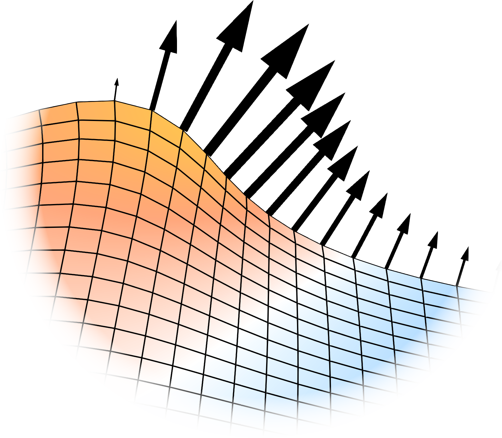

{width=55% fig-align="center"}

    Welcome to <b>CoMBo-Foam</b>!
     

    The library to solve <b>Co</b>upled <b>M</b>oving <b>Bo</b>undary problems in Open-<b>Foam</b>
     
     

## What this library can do

This library provides tools for solving coupled moving boundary problems in OpenFOAM using dynamic meshes. These are problems that include a moving surface where the movement of the surface is captured by moving the underlying mesh. Currently the libraray covers melting and refreezing processes according to the Stefan condition and free surface flow. The design of this library is however general enough to be extended to any moving boundary problem. This is done in a minimally invasive way as no change to the individual solvers is done.

The easiest way to see what this library can do is to have a look at the examples for [Phase Change](examples/2D-stefan-problem.qmd) and for [Free surface flow](examples/free-surface-wave.qmd). Also check out the information on [Installation](installation.qmd) and the more in-depth [Documentation](./documentation/general_idea.qmd).

## Which OpenFOAM versions are supported

Currently, the only fully supported OpenFOAM version is v14 of the [openfoam.org](https://openfoam.org) branch of OpenFOAM. Support for future versions of this branch is also planned. v12 is partially supported.
